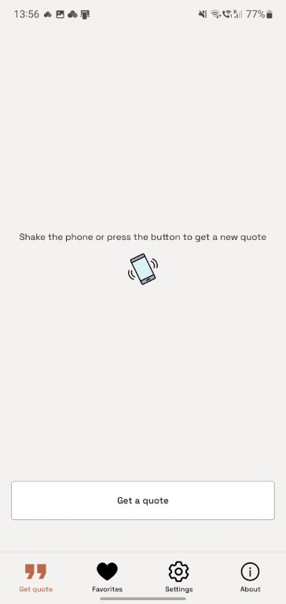

# Quote Shake

Simple React Native quotes app.

## Functionality

### Welcome screen

- App logo and info is displayed.

### Get quote screen

- A button press or a phone shake fetches a new quote from the API and displays on the screen.
- A new one is fetched if the received quote is already in favorites.
- Retry mechanism is implemented in case of API failure.
- The quote can be added to favorites.
- If the quote author is available, the user can open a Wikipedia page about the author.

  
  

### Favorites screen

- Favorite quotes are persisted in AsyncStorage.
- All quotes added to favorites are displayed.
- If there are no quotes in favorites, a message is displayed.
- If the quote is selected, it can be removed from favorites or opened in Wikipedia (if information about the author is present).
- All quotes can be removed from favorites at once. A confirmation dialog is displayed.

  
  
  

### Settings screen

- All settings are persisted in AsyncStorage.
- The language of the quotes received (English or Russian) can be changed.
- Getting quotes on phone shakes can be enabled or disabled.
- Phone shake sensitivity can be changed (if enabled).
- The app can be reset to default settings.

  
  

### About screen

- App logo and info is displayed.

