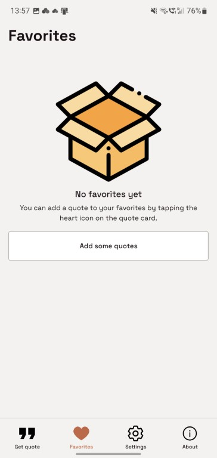

# Quote Shake

Simple React Native quotes app.

## Functionality

### Welcome screen

- App logo and info is displayed.

### Get quote screen

- On button press or on phone shake, a new quote is fetched from the API and displayed on the screen.
- If the received quote is already in favorites, a new one is fetched.
- Retry mechanism is implemented in case of API failure.
- The quote can be added to favorites.
- If quote author is available, user can open a Wikipedia page about the author.

### Favorites screen

- Favorites quotes are persisted in AsyncStorage.
- All quotes added to favorites are displayed.
- If there are no quotes in favorites, a message is displayed.
- If quote is selected, it can be removed from favorites or opened in Wikipedia (if information about the author is present).
- All quotes can be removed from favorites at once. A confirmation dialog is displayed.

### Settings screen

- All settings are persisted in AsyncStorage.
- The language of the quotes received can be changed (English or Russian).
- Getting quotes on phone shake can be enabled or disabled.
- Phone shake sensitivity can be changed (if enabled).
- The app can be reset to default settings.

### About screen

- App logo and info is displayed.

